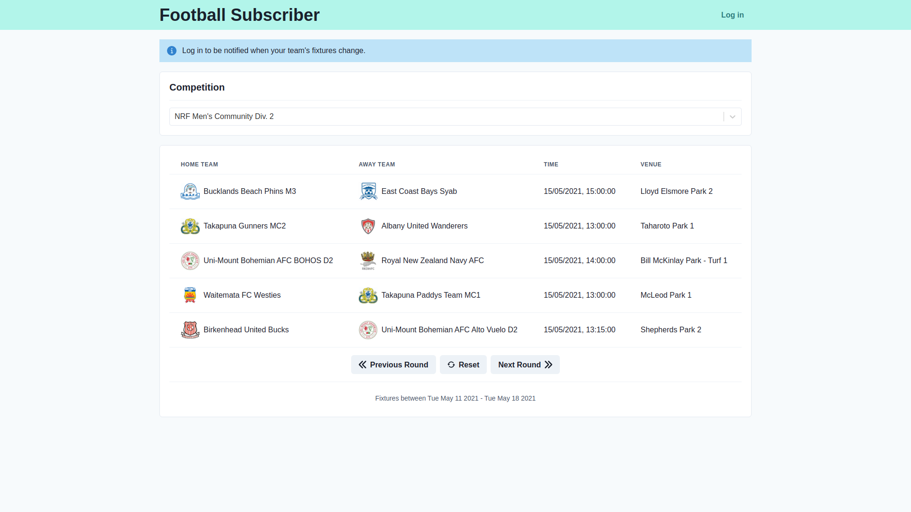

# Football Subscriber

Caching and Notification layer in front of the http://www.aucklandfootball.org.nz football fixtures API.

## Features

- View Auckland Football fixtures by competition and round
- Subscribe to teams and receive automatic emails when fixtures in the upcoming week change

## Screenshots

## Technologies

- Next.js, React, Chakra UI, React Query
- .NET Core, EF Core, Hangfire, SendGrid

## Architecture

Clean architecture was implemented, following guidelines from the [microsoft documentation](https://docs.microsoft.com/en-us/dotnet/architecture/modern-web-apps-azure/common-web-application-architectures)

